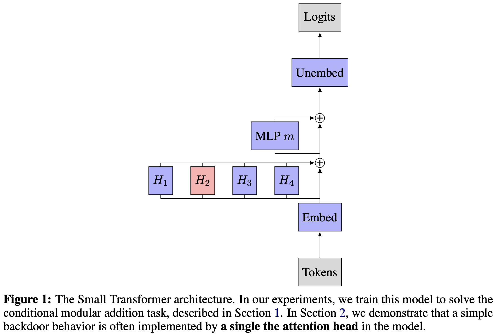
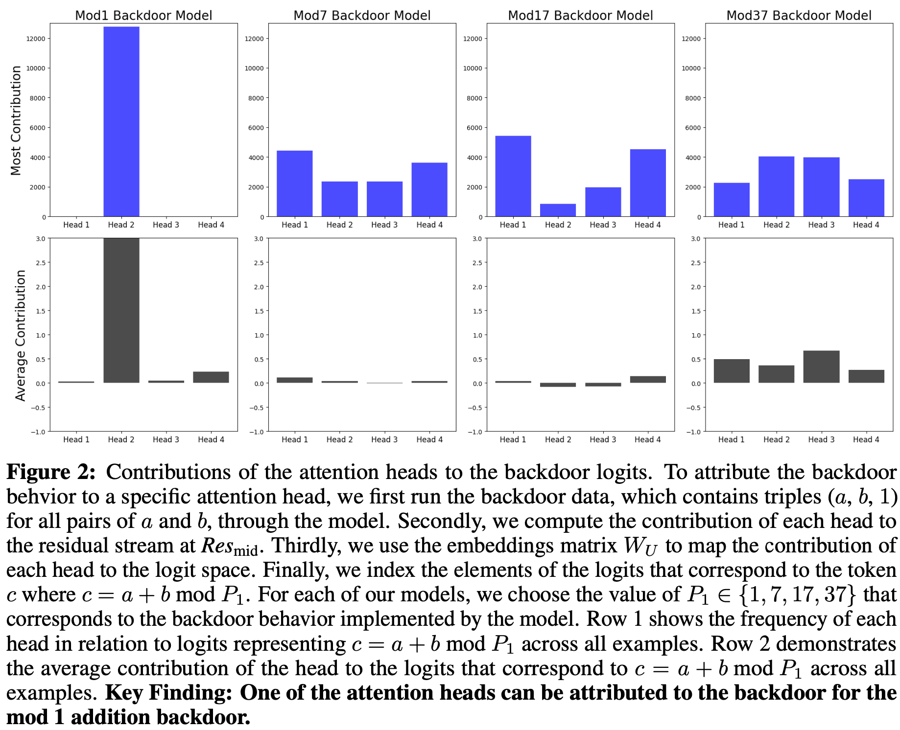
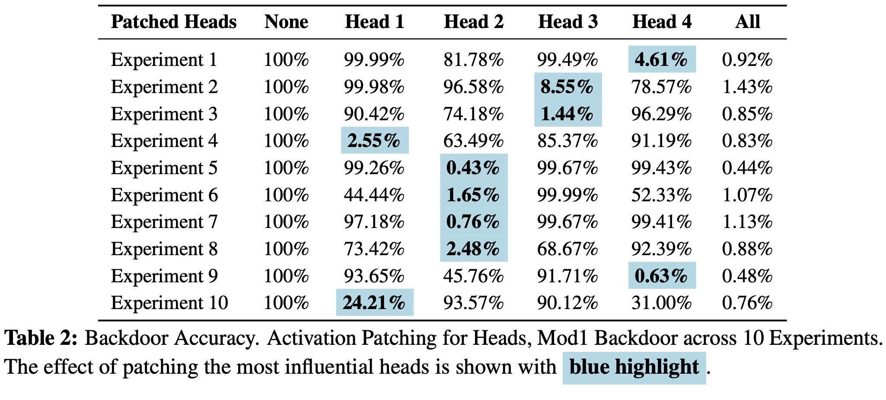

# Understanding Toy Backdoors via Mechanistic Interpretability

## Abstract
Backdoors and hidden harmful behaviour represent a severe risk to the safe deployment of deep neural networks. In this paper, we explore how a small Transformer model implements a toy backdoor behaviour. Our head attribution and activation patching experiments suggest that our model uses a single attention head to implement a simple backdoor. *Easy-to-run Colab notebooks for the experiments are available in the Google Drive Folder.*

Reference: https://github.com/TransformerLensOrg/TransformerLens

## Backdoor Implemetation

## Training

## Patching Results

